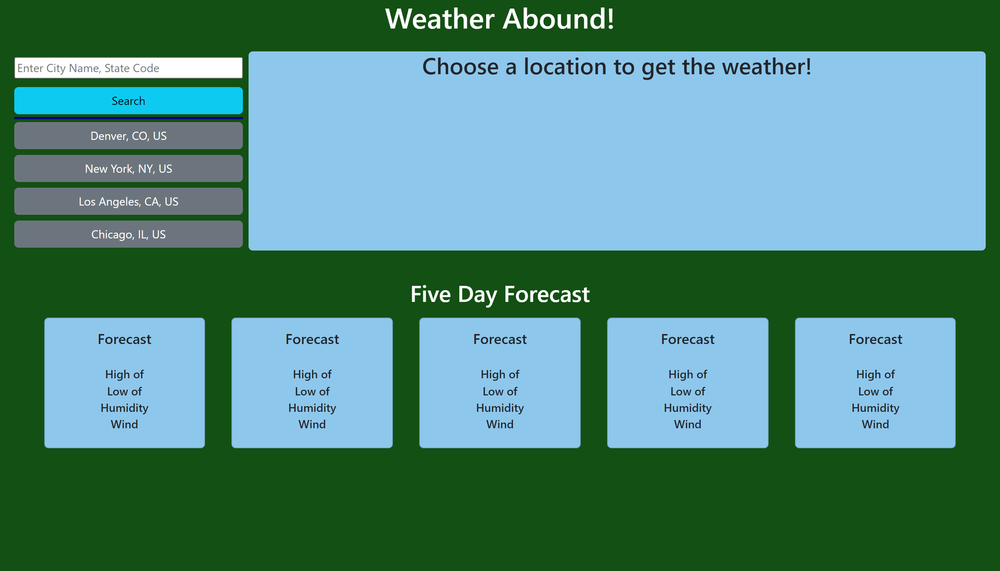

# weather-dashboard-application

## Description

This is a web application that pulls from the weatherbit.io API to allow a user to input a location and get back the current weather and 5 day forecast for that location. When a location is selected it takes the location and puts it in the last done search buttons below the input field.

[Weather Application](https://tatefoster.github.io/weather-dashboard-application/)

.png>)
